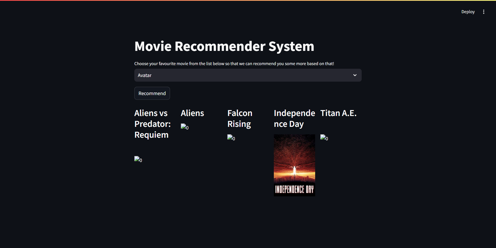

# 🎬 Movie Recommender System


This repository contains a **Movie Recommendation System App** built using **Streamlit**, **Pandas**, and **Scikit-learn**.  
It allows users to choose a movie and receive 5 similar movie recommendations with posters based on content similarity.  
The app uses metadata such as cast, crew, genre, keywords, and overview to calculate cosine similarity and generate recommendations.

---

## 📁 Project Folder Structure

```
📦 Movie-Recommender-System/
├── app.py                         # Main Streamlit app
├── movies_list_with_posters.pkl  # Pickled movie dataframe with poster URLs (Not included)
├── similarity_matrix.pkl         # Pickled similarity matrix (Not included)
├── tmdb_5000_movies.csv          # Raw movies metadata (Not included)
├── tmdb_5000_credits.csv         # Raw cast and crew metadata (Not included)
├── Movie Recommender System.ipynb# Jupyter notebook for data cleaning, preprocessing & model
├── requirements.txt              # All required Python libraries
├── README.md                     # Project documentation
```

> ⚠️ **Large files like `similarity_matrix.pkl`, `tmdb_5000_movies.csv`, and `tmdb_5000_credits.csv` are not included in this repository due to GitHub size limits.**  
> 📥 **[Download them from this Google Drive link](https://drive.google.com/drive/folders/1k3bYd6Z3LmgPLBFiUb3o27Oq-cgz-cYE?usp=drive_link)**

---

## 🎯 Key Features

- 🎥 **Interactive Movie Recommendation**  
  Select a movie and get 5 similar movies instantly.

- 🧠 **Content-Based Filtering**  
  Recommendations based on movie metadata like genres, keywords, cast, crew, and overview.

- 🎨 **Poster Visualization**  
  Displays movie posters fetched via pre-stored URLs.

- ⚡ **Fast & Responsive**  
  Powered by Streamlit for a smooth user experience.

---

## 🧪 Dataset Used

- `tmdb_5000_movies.csv`
- `tmdb_5000_credits.csv`

📌 Source: [TMDB Dataset on Kaggle](https://www.kaggle.com/datasets/tmdb/tmdb-movie-metadata)

These files were processed and combined to create the `.pkl` files used in the app.

---

## ⚙️ Recommendation Logic

- Combined metadata features: `overview`, `keywords`, `genres`, `cast`, `crew`
- Processed into a single string (soup)
- Transformed using `CountVectorizer`
- Similarity measured with **cosine similarity**
- Top 5 similar movies retrieved and their posters displayed

---

## 📸 UI Screenshot



---

## 💻 Setup Instructions

### 🔧 Clone the Repository

```bash
git clone https://github.com/sg2499/Movie-Recommender-System.git
cd Movie-Recommender-System
```

### 🐍 Create a Virtual Environment

```bash
conda create -n movie_app python=3.11
conda activate movie_app
```

### 📦 Install Dependencies

```bash
pip install -r requirements.txt
```

### 🚀 Run the App

```bash
streamlit run app.py
```

---

## 📝 Requirements

Key libraries used:

- `streamlit`
- `pandas`
- `scikit-learn`
- `requests`
- `pickle`

Full list is available in `requirements.txt`.

---

## 📬 Author

Created with ❤️ by **Shailesh Gupta**  
🔗 GitHub: [sg2499](https://github.com/sg2499)  
📩 Email: shaileshgupta841@gmail.com  

> Powered by Streamlit · Inspired by Movies · Delivered with Code 🎥
